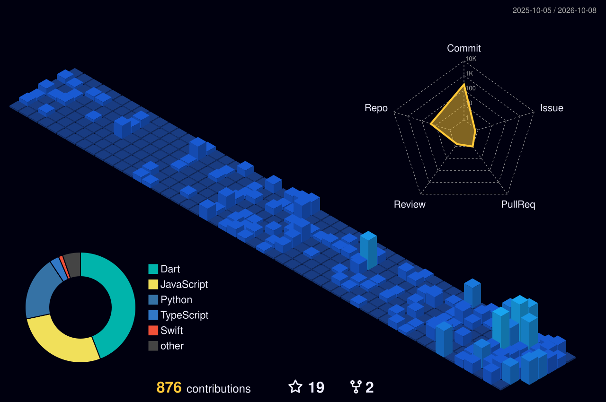

<!-- Local Self-Hosted Header: High-res Vector Banner (Zero Third-Party Dependency) -->

  

<!-- Dynamic Terminal Typing Animation -->

 

<!-- Two-column Intro: Profile Narrative + Animated Dev Cat -->
<table border="0" width="100%" style="border-collapse: collapse;">
  <tr>
    <td width="62%" valign="top" style="border: none; padding-right: 20px;">
      <h3>Engineering end-to-end mobile &amp; distributed systems.</h3>
      

        I am a <b>Mobile &amp; Fullstack Developer</b> specializing in engineering robust, high-performance applications—from native <b>Android (Kotlin, Jetpack Compose)</b> and cross-platform <b>Flutter</b> clients to scalable backend services in <b>Go</b> and <b>Python (Django Ninja)</b>.
      

      

        My work emphasizes maintainable Clean Architecture, deterministic state management, responsive UI design, and resilient offline-first data handling that guarantees seamless user experience even with intermittent connectivity.
      

      <ul>
        <li><b>Mobile Engineering:</b> Native Android (Kotlin, Jetpack Compose) &amp; Cross-Platform (Flutter)</li>
        <li><b>Fullstack &amp; Backend:</b> Go (Golang), Python (Django Ninja), React / Next.js, PostgreSQL, Docker</li>
        <li><b>Architecture &amp; Quality:</b> Clean Architecture, MVVM, Offline-First Sync, RESTful APIs</li>
        <li><b>Proven Traction:</b> Over 3,200+ organic Play Store installs &amp; deployed production web platforms</li>
      </ul>
    </td>
    <td width="38%" align="center" valign="middle" style="border: none;">
      
    </td>
  </tr>
</table>

 

---

### Featured Deployments & Projects

<table>
  <tr>
    <td width="50%" valign="top">
      <h4><a href="https://github.com/hafidz111/balance_apps">Starvy</a></h4>
      
<b>Store Operations &amp; Daily Sales Reporting Platform</b>

      
Cross-platform mobile solution replacing fragmented manual store reporting. Features multi-shift sales logging, automated APC &amp; metrics calculation, barcode scanning, photo grids, and instant WhatsApp dispatch. Achieved over <b>3,200+ organic downloads</b> on Google Play Store.

      
<code>Flutter</code> · <code>Provider</code> · <code>Cloud Firestore</code> · <code>Firebase Auth</code> · <code>Google Mobile Ads</code>

    </td>
    <td width="50%" valign="top">
      <h4><a href="https://github.com/hafidz111/dicoding-jobs">Dicoding Jobs</a></h4>
      
<b>Tech Career & Vacancy Exploration Platform</b>

      
Streamlined job discovery platform featuring intuitive search filtering, comprehensive job specifications, and responsive client-server communication backed by RESTful endpoints.

      
<code>TypeScript</code> · <code>React / Next.js</code> · <code>REST API</code> · <code>Tailwind CSS</code>

    </td>
  </tr>
  <tr>
    <td width="50%" valign="top">
      <h4><a href="https://github.com/hafidz111">Danusan</a></h4>
      
<b>Integrated Campus Fundraising Infrastructure</b>

      
End-to-end fundraising coordination engine built with high-throughput Go backend services, relational PostgreSQL schema, S3-compatible MinIO object storage, and a responsive frontend interface.

      
<code>Go (Golang)</code> · <code>Next.js / React</code> · <code>PostgreSQL</code> · <code>MinIO S3</code> · <code>Docker</code>

    </td>
    <td width="50%" valign="top">
      <h4><a href="https://github.com/hafidz111/flood-detection">Flood'nt</a></h4>
      
<b>Real-Time IoT Hydrological Telemetry & Alert App</b>

      
Early-warning flood telemetry platform bridging physical water-level sensors with real-time stream ingestion and immediate mobile push dispatch for rapid flood awareness.

      
<code>Flutter</code> · <code>Firebase Streams</code> · <code>IoT Sensors</code> · <code>Push Alerts</code>

    </td>
  </tr>
</table>

 

---

### Technical Arsenal

| Domain | Technologies & Frameworks |
| :--- | :--- |
| **Mobile Engineering** | `Kotlin` · `Jetpack Compose` · `Android SDK` · `Flutter` · `Dart` |
| **Architecture & Local Data** | `Clean Architecture` · `MVVM` · `Room / SQLite` · `Offline-First Sync` · `State Management` |
| **Backend & APIs** | `Python (Django Ninja)` · `Go (Golang)` · `REST APIs` · `PostgreSQL` · `Firebase` |
| **Tools & Platforms** | `Git` · `Docker` · `Google Play Console` · `CI/CD Workflows` |

 

---

### 3D Contribution Skyline & Activity

<!-- 3D Isometric Contribution Grid rendered by GitHub-Profile-3D-Contrib Action -->
<picture>
  <source media="(prefers-color-scheme: dark)" srcset="profile-3d-contrib/profile-night-view.svg">
  <source media="(prefers-color-scheme: light)" srcset="profile-3d-contrib/profile-green-animate.svg">
  
</picture>

 

---

### Engineering Telemetry & Metrics

